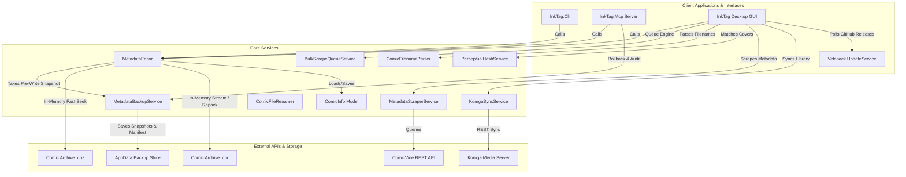

# System Architecture

This page outlines the high-level architecture of the InkTag solution.

---

## 🏗️ Solution Overview

The solution is organized into standard `src/` and `tests/` layers:
1. **`InkTag.Core` (Domain & Services Library)**:
   * Provides domain models (`ComicInfo`), schema validation (`ComicInfo.xsd`), dynamic JSON patching, in-memory streaming, and atomic archive repackaging (`MetadataEditor` façade delegating to `ComicArchiveHandler`, `ArchiveSwapService`, and `ComicInfoXmlSanitizer`).
   * Provides domain error classifications under `InkTag.Core.Exceptions` (`InkTagException`, `ComicArchiveException`, `ComicArchiveCorruptException`, `MetadataXmlSanitizationException`, `UnsafeArchiveEntryException`).
   * Provides supplementary domain services:
     * **`MetadataBackupService`**: Automated pre-write snapshots, atomic multi-file transaction rollbacks (`BatchJobId`), forensic provenance audit trails, and automatic retention management in isolated AppData (`~/.local/share/InkTag/backups/`).
     * **`ComicFilenameParser`**: Smart filename and 2-level ancestor directory metadata inference.
     * **`PerceptualHashService`**: 64-bit difference perceptual image hashing (`dHash`) and visual cover matching.
     * **`MetadataScraperService` & `ComicVineProvider`**: ComicVine REST scraping with smart volume lifespan year scoring, caching, and rate limiting.
     * **`BulkScrapeQueueService`**: Pipelined parallel cover extraction, on-demand candidate thumbnail hashing, and queue resolution.
     * **`ComicFileRenamer`**: Token-based file renaming engine with collision resolution.
     * **`KomgaClient` & `KomgaSyncService`**: Direct Komga media server REST API synchronization with collections management and Docker/NAS path translation.
2. **`InkTag.Cli` (Agentic CLI Utility)**: Allows scanning folders, structured `--json` execution, reading, updating, renaming, scraping, cover extraction, and schema exporting from the command line.
3. **`InkTag.Mcp` (MCP Server)**: Exposes 14 Model Context Protocol stdio tools for AI agents (Claude Desktop, Cursor, Antigravity) with strict read-only mode, safe-by-default dry runs, and forensic backup restoration. Published as a single-file executable (`PublishSingleFile=true`) and bundled inside application packages.
4. **`InkTag.Gui` (InkTag Desktop)**: Multi-platform visual spreadsheet and bulk-edit panel built with Avalonia UI. Features dynamic Light/Dark/System theme switching, bounded parallel scanning, Series Search Wizard, Bulk Auto-Tag queue with visual breakdown tooltips, Komga synchronization, and Velopack auto-updating.
5. **`InkTag.Tests` (Test Suite)**: Comprehensive xUnit test suite (184 unit & integration tests).

---

## 🔄 Data Access & Repackaging Lifecycles

### 1. In-Memory Read Lifecycle (Fast Path)
* `OpenReadOptimized` opens a buffered stream with `FileShare.ReadWrite` and `FileOptions.None` (compatible with Linux FUSE / GVFS / FTP / SMB mounts).
* `.cbz` archives read `ComicInfo.xml` directly from memory using .NET's `ZipArchive` (0 temporary disk I/O).
* `.cbr` (RAR) archives and fallback streams use SharpCompress in-memory readers with `LookForHeader = true`.

### 2. Automated Pre-Write Disaster Recovery Lifecycle
Prior to executing any modifying disk operation:
1. `MetadataEditor` reads the current archive metadata and extracts the front cover image bytes.
2. Computes the pre-write source SHA-256 hash and 64-bit cover `dHash`.
3. `MetadataBackupService` persists a timestamped snapshot of `ComicInfo.xml` to `~/.local/share/InkTag/backups/`.
4. Records forensic provenance (source hash, cover dHash, remote thumbnail URL, confidence score, change reason, batch job ID, diffs) in the backup manifest.

### 3. Archive Repackaging Lifecycle (Write Path)
Modifying compressed archives uses atomic repackaging:
1. **Extraction**: Unpacks archive entries to a unique temporary working directory.
2. **XML Manipulation**: `ComicInfo.xml` is modified, validated against `ComicInfo.xsd`, and written to the working folder.
3. **Compression**: Repacks files into a temporary `.tmp` archive.
4. **Integrity Validation**: Verifies the newly created archive is readable and uncorrupted.
5. **Atomic Swap & Rollback**:
   * Renames the original archive to `.bak`.
   * Swaps `.tmp` into the destination filename slot.
   * If any exception occurs, the system automatically restores `.bak`.
   * On verified success, `.bak` is cleanly removed.

---

## 🪵 Logging & Diagnostics

InkTag includes a centralized, cross-platform thread-safe logging infrastructure (`AppLogger` in `InkTag.Core.Logging`).

Console mirroring goes to **stderr** (`Console.Error`), never stdout. `InkTag.Mcp` speaks JSON-RPC over stdout and `InkTag.Cli` reserves stdout for its own `--json` output, so any log line on stdout would corrupt machine-readable consumers. The file sink is always the authoritative log.

### Log Locations Across Platforms
- **Linux**: `~/.local/share/InkTag/logs/InkTag.log`
- **Windows**: `%LocalAppData%\InkTag\logs\InkTag.log`
- **macOS**: `~/Library/Application Support/InkTag/logs/InkTag.log`

Velopack auto-updater system logs are stored in the parent `InkTag` directory (e.g., `~/.local/share/InkTag/Velopack.log` on Linux).

### Diagnostics & Auto-Updater Diagnostics
- `UpdateService` logs update check requests, GitHub release queries, rate limiting status, and download progress.
- `UpdateService.CheckForUpdatesAsync()` returns structured `UpdateCheckResult` detailing status (`UpdateAvailable`, `UpToDate`, `UninstalledDevBuild`, or `Failed`).
- Running uninstalled/dev builds explicitly logs warnings and displays *"Update check unavailable (Uninstalled dev build)"* to prevent confusion with failed network checks.

