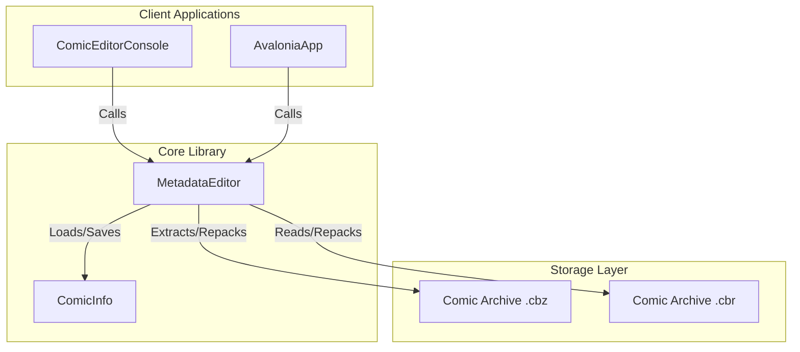

# System Architecture

This page outlines the high-level architecture of the ComicMetadataEditor solution.

---

## 🏗️ Solution Overview

The solution consists of three main projects:
1. **`ComicMetadataEditor` (Core Library)**: Provides the domain models (`ComicInfo`) and archive manipulation logic (`MetadataEditor` wrapping `SharpCompress`).
2. **`ComicEditorConsole` (CLI Utility)**: Allows scanning folders and bulk-editing metadata values from the command line.
3. **`AvaloniaApp` (Desktop Application)**: Offers a multi-platform visual spreadsheet and bulk-edit panel.

---

## 🔄 Core Data Flow (Archive repackaging)

Because comic archives are compressed zip or rar files, modifying `ComicInfo.xml` directly inside them is not feasible. The library implements a **safe, atomic-like repackaging flow**:

1. **Extraction**: The file is unpacked into a temporary folder using `SharpCompress`.
2. **XML Manipulation**: `ComicInfo.xml` is read, edited (or created if missing), validated against `ComicInfo.xsd`, and serialized back into the folder.
3. **Zipping**: The directory is compressed to a temporary `.tmp` archive.
4. **Validation**: The new `.tmp` archive is scanned to verify it is uncorrupted and contains readable entries.
5. **Atomic Swap**: 
   * The original archive is renamed to `.bak`.
   * The `.tmp` archive is moved into the target filename slot.
   * If any step fails, the system executes a rollback, restoring the original archive from `.bak`.
   * On complete success, the `.bak` files are deleted.
