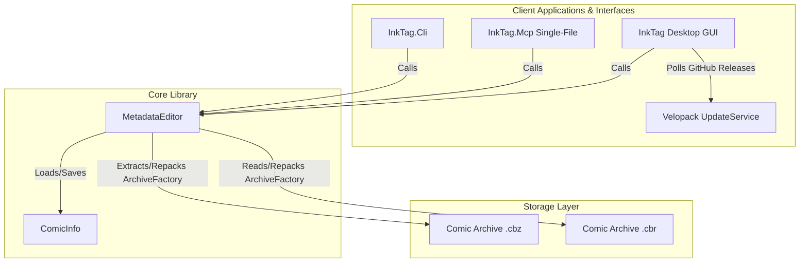

# System Architecture

This page outlines the high-level architecture of the InkTag solution.

---

## 🏗️ Solution Overview

The solution is organized into standard `src/` and `tests/` layers:
1. **`InkTag.Core` (Domain Library)**: Provides the domain models (`ComicInfo`), dynamic JSON patching, cover art extraction, and archive manipulation logic (`MetadataEditor` wrapping `SharpCompress` random-access `ArchiveFactory.OpenArchive()`).
2. **`InkTag.Cli` (Agentic CLI Utility)**: Allows scanning folders, structured `--json` execution, reading, updating, cover extraction, and schema exporting from the command line.
3. **`InkTag.Mcp` (MCP Server)**: Exposes stdio Model Context Protocol tools for AI agents (Claude Desktop, Cursor, Antigravity). Published as a single-file executable (`PublishSingleFile=true`) and bundled inside the macOS app bundle (`InkTag.app/Contents/MacOS/InkTag.Mcp`).
4. **`InkTag.Gui` (InkTag Desktop)**: Offers a multi-platform visual spreadsheet and bulk-edit panel built with Avalonia UI. Integrated with `Velopack` (`UpdateService`) for rate-limited silent auto-updating against GitHub Releases.
5. **`InkTag.Tests` (Test Suite)**: Automated unit tests using xUnit.

---

## 🔄 Core Data Flow (Archive repackaging)

Because comic archives are compressed zip or rar files, modifying `ComicInfo.xml` directly inside them is not feasible. The library implements a **safe, atomic-like repackaging flow**:

1. **Extraction**: The file is parsed into a temporary folder using `SharpCompress` random-access `ArchiveFactory.OpenArchive(stream)`, ensuring reliable handling of both `.cbz` and `.cbr` (RAR v4 / RAR v5) archives and stream endpoints.
2. **XML Manipulation**: `ComicInfo.xml` is read, edited (or created if missing), validated against `ComicInfo.xsd`, and serialized back into the folder.
3. **Zipping**: The directory is compressed to a temporary `.tmp` archive.
4. **Validation**: The new `.tmp` archive is scanned using `ArchiveFactory.OpenArchive()` to verify it is uncorrupted and contains readable entries.
5. **Atomic Swap**: 
   * The original archive is renamed to `.bak`.
   * The `.tmp` archive is moved into the target filename slot.
   * If any step fails, the system executes a rollback, restoring the original archive from `.bak`.
   * On complete success, the `.bak` files are deleted.
