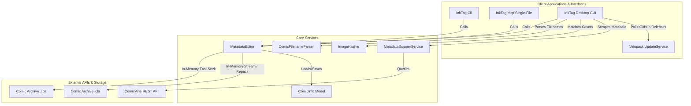

# System Architecture

This page outlines the high-level architecture of the InkTag solution.

---

## 🏗️ Solution Overview

The solution is organized into standard `src/` and `tests/` layers:
1. **`InkTag.Core` (Domain & Services Library)**:
   * Provides domain models (`ComicInfo`), schema validation (`ComicInfo.xsd`), dynamic JSON patching, in-memory streaming, and atomic archive repackaging (`MetadataEditor`).
   * Provides supplementary domain services: smart filename parsing (`ComicFilenameParser`), 64-bit difference perceptual image hashing (`ImageHasher`), and ComicVine metadata scraping (`MetadataScraperService`, `ComicVineProvider`).
2. **`InkTag.Cli` (Agentic CLI Utility)**: Allows scanning folders, structured `--json` execution, reading, updating, cover extraction, and schema exporting from the command line.
3. **`InkTag.Mcp` (MCP Server)**: Exposes stdio Model Context Protocol tools for AI agents (Claude Desktop, Cursor, Antigravity). Published as a single-file executable (`PublishSingleFile=true`) and bundled inside the macOS app bundle (`InkTag.app/Contents/MacOS/InkTag.Mcp`).
4. **`InkTag.Gui` (InkTag Desktop)**: Multi-platform visual spreadsheet and bulk-edit panel built with Avalonia UI. Features bounded parallel scanning, Series Search Wizard, perceptual cover matching, and Velopack auto-updating.
5. **`InkTag.Tests` (Test Suite)**: Comprehensive unit and integration test suite using xUnit.

---

## 🔄 Data Access & Repackaging Lifecycles

### 1. In-Memory Read Lifecycle (Fast Path)
* `OpenReadOptimized` opens a buffered stream with `FileShare.ReadWrite` and `FileOptions.None` (compatible with Linux FUSE / GVFS / FTP / SMB mounts).
* `.cbz` archives read `ComicInfo.xml` directly from memory using .NET's `ZipArchive` (0 temporary disk I/O).
* `.cbr` (RAR) archives and fallback streams use SharpCompress in-memory readers with `LookForHeader = true`.

### 2. Archive Repackaging Lifecycle (Write Path)
Modifying compressed archives requires safe, atomic-like repackaging:
1. **Extraction**: Unpacks archive entries to a unique temporary working directory.
2. **XML Manipulation**: `ComicInfo.xml` is deserialized, modified, validated against `ComicInfo.xsd`, and written to the working folder.
3. **Compression**: Repacks files into a temporary `.tmp` archive.
4. **Integrity Validation**: Verifies the newly created archive is readable and uncorrupted.
5. **Atomic Swap & Rollback**:
   * Renames the original archive to `.bak`.
   * Swaps `.tmp` into the destination filename slot.
   * If any exception occurs, the system automatically restores `.bak`.
   * On verified success, `.bak` is cleanly removed.

---

## 🪵 Logging & Diagnostics

InkTag includes a centralized, cross-platform thread-safe logging infrastructure (`AppLogger` in `InkTag.Core.Logging`).

### Log Locations Across Platforms
- **Linux**: `~/.local/share/InkTag/logs/InkTag.log`
- **Windows**: `%LocalAppData%\InkTag\logs\InkTag.log`
- **macOS**: `~/Library/Application Support/InkTag/logs/InkTag.log`

Velopack auto-updater system logs are stored in the parent `InkTag` directory (e.g., `~/.local/share/InkTag/Velopack.log` on Linux).

### Diagnostics & Auto-Updater Diagnostics
- `UpdateService` logs update check requests, GitHub release queries, rate limiting status, and download progress.
- `UpdateService.CheckForUpdatesAsync()` returns structured `UpdateCheckResult` detailing status (`UpdateAvailable`, `UpToDate`, `UninstalledDevBuild`, or `Failed`).
- Running uninstalled/dev builds explicitly logs warnings and displays *"Update check unavailable (Uninstalled dev build)"* to prevent confusion with failed network checks.

